# Mini Trello App – Real-Time Board Management Tool

A mini Trello-like application that allows users to manage boards, columns, and tasks with **real-time collaboration**.

---

## Tech Stack

### Frontend (Client)
- **Framework:** Next.js 14 (App Router)
- **Language:** TypeScript
- **Styling:** Tailwind CSS
- **State Management & Data Fetching:** TanStack Query (React Query)
- **Real-Time Communication:** Socket.io Client
- **Drag & Drop:** @hello-pangea/dnd
- **Icons:** React Icons

### Backend (Server)
- **Runtime:** Node.js
- **Framework:** Express.js
- **Database:** Firebase Firestore (NoSQL)
- **Authentication:** Firebase Admin SDK & JWT
- **Real-Time Communication:** Socket.io Server

---

### Project Structure

The project is separated into **Client** and **Server** folders.
---


## Frontend Architecture (Service–Hook Pattern)

Inside the `client` folder, a layered architecture is used to keep UI components clean, reusable, and maintainable.

- **components/**  
  Contains atomic UI components (e.g., Button) and business components such as modals for creating boards.

- **libs/axios/**  
  Axios instance configured with:
  - `baseURL`
  - Request interceptor to attach authentication token
  - Response interceptor for global error handling

- **services/**  
  Handles API calls using Axios. Completely isolated from UI logic.

- **hooks/**  
  Custom React hooks built with TanStack Query to:
  - Call services
  - Manage caching
  - Handle loading and error states

- **types/**  
  Shared TypeScript interfaces to ensure strict typing across the application.

---

## Backend Architecture (MVC Pattern)

The backend follows the **Model–View–Controller (MVC)** pattern.

- **models/**  
  Classes representing database entities and interacting directly with Firebase Firestore  
  (Board, Card, Task, User, AuthCode, Invitation)

- **controllers/**  
  Handle incoming HTTP requests and coordinate business logic

- **routes/**  
  Define API endpoints and connect them to controllers

- **middleware/**  
  Authentication and authorization middleware (JWT verification)

---

## Redis Write-Back Strategy

To optimize database operations and reduce the load on Firebase Firestore, the backend implements a **Redis Write-Back** caching strategy:

- **Append-Only File (AOF) with Redis Streams:**  
  Write operations are fast-queued into a Redis Stream (`write_aof`) rather than being executed directly against the database.
- **Write Coalescing:**  
  A background worker periodically reads operations from the stream in batches. If multiple updates target the same document within a single batch window, they are intelligently merged (coalesced) to form the final document state.
- **Batch Updates:**  
  The coalesced updates are then written to Firestore concurrently using a bulk batch commit (`db.batch()`). This significantly reduces total database write operations, minimizes latency, and lowers Firestore billing costs.

---

### Prerequisites

Before running the project, make sure you have:

- **Node.js** v18 or higher
- **npm** or **yarn**

Accounts required:
- **Firebase** (Firestore Database)
- **GitHub / Google Cloud** (OAuth Client IDs)

---

## Getting Started
### Clone the Repository

```bash
git clone https://github.com/O-VanTho-programmer/MiniTrelloApp.git
cd MiniTrelloApp
```

## Backend Stepup
```bash
cd server
npm install
```

Create .env inside server/
```bash
PORT=5000
CLIENT_URL=http://localhost:3000
JWT_SECRET=your_super_secret_key

# OAuth Credentials
GITHUB_CLIENT_ID=your_github_client_id
GITHUB_CLIENT_SECRET=your_github_client_secret
GOOGLE_CLIENT_ID=your_google_client_id
GOOGLE_CLIENT_SECRET=your_google_client_secret

# Nodemailer
EMAIL_USER=your_email@gmail.com
EMAIL_PASS=your_email_app_password
```

Firebase Configuration
Download serviceAccountKey.json from:
Firebase Console → Project Settings → Service Accounts
Place the file inside the server/ directory

Run server:
```bash
node .\server.js
```
Server run at: http://localhost:5000

## Frontend Setup

Open a new terminal and navigate to the client folder:

cd ../client
npm install

Environment Configuration

Create a .env.local file inside client/:
```bash
NEXT_PUBLIC_SERVER_URL=http://localhost:5000
NEXT_PUBLIC_GITHUB_CLIENT_ID=your_github_client_id
NEXT_PUBLIC_GOOGLE_CLIENT_ID=your_google_client_id
```
Run Client
npm run dev

Client runs at: http://localhost:3000

# Screenshots
The project is separated into **Client** and **Server** folders.
---
### Login
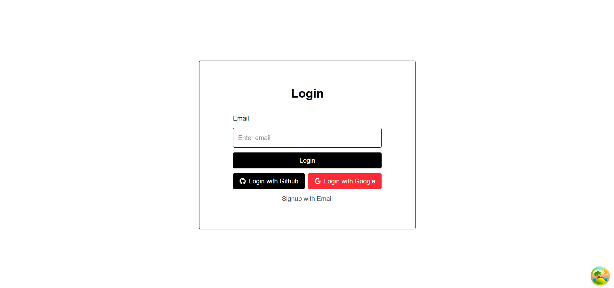

### Sign up
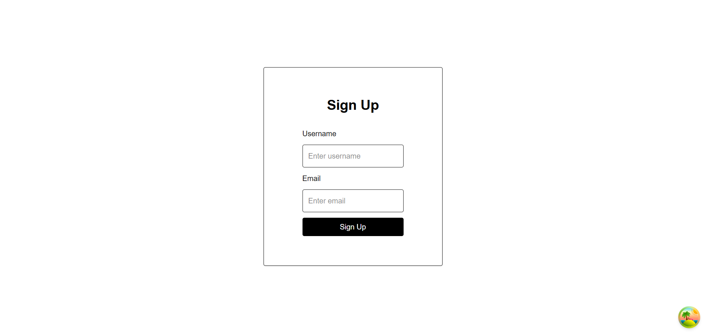

### Enter Verification Code
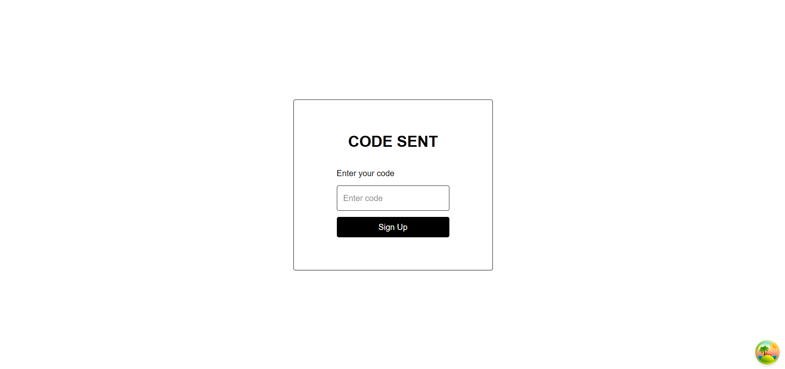

### Workplace
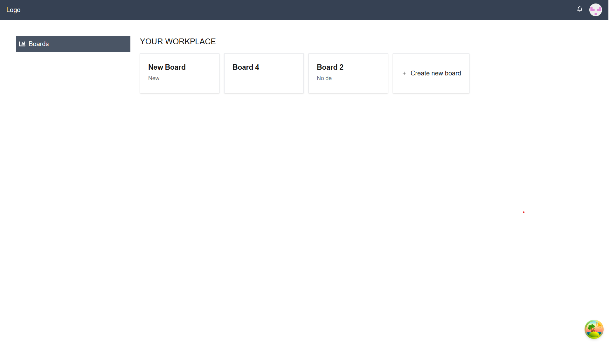

### New Board
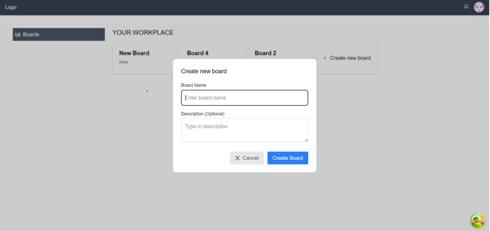

### Board Page
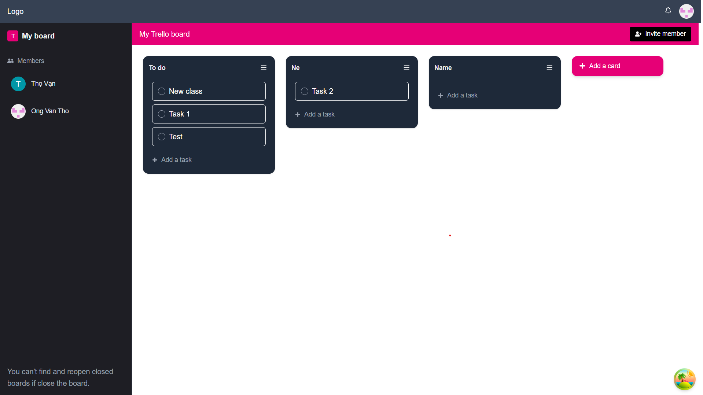

### New Card
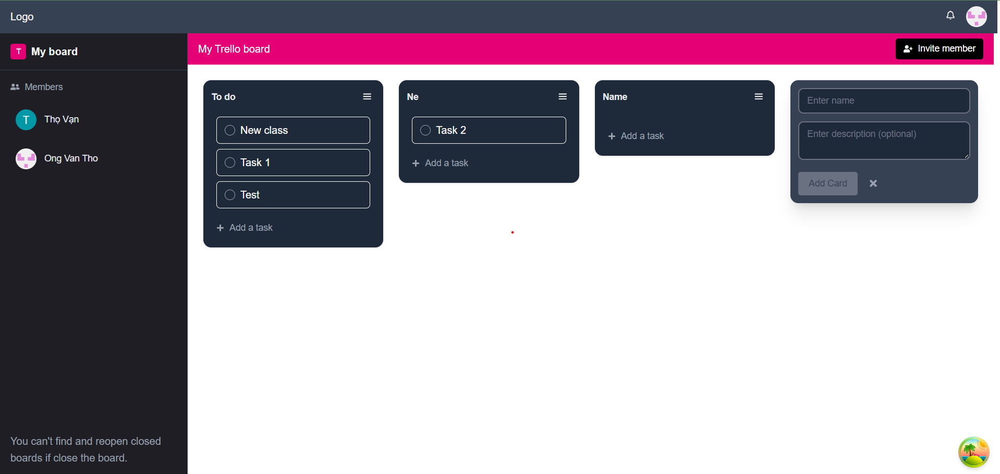

### New Task
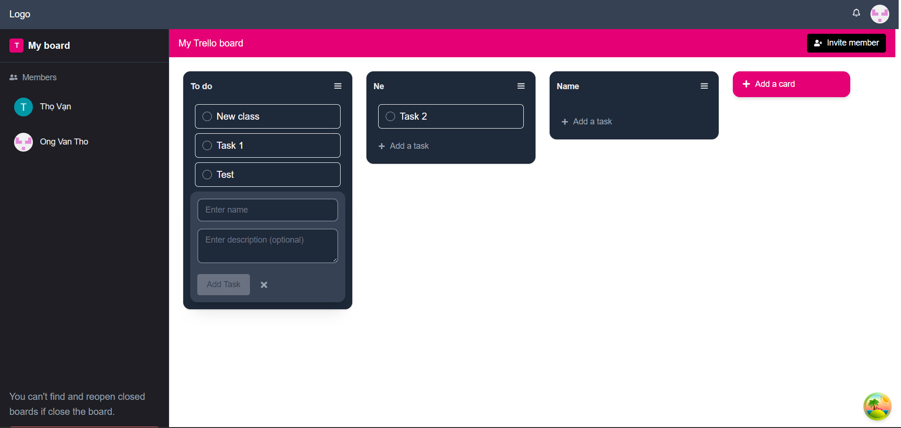

## Drag and Drop
### Drag and Drop in User A

### Update real-time in User B
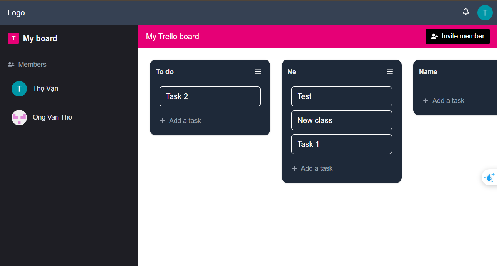

### Detail Task and Assigned Members
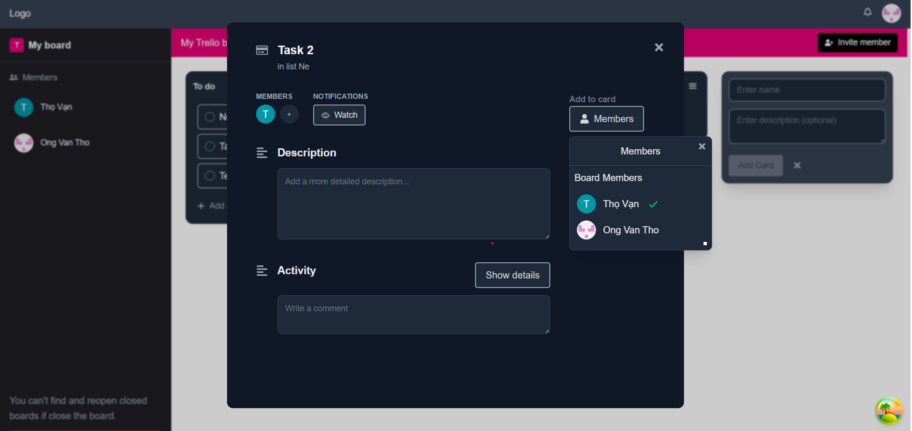

### Invite to board Notification


### Invite to board Notification
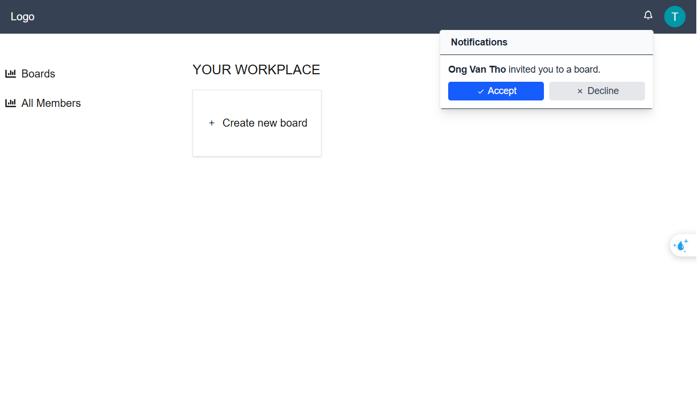

### Responed Invitation


### Get Repositories From GitHub
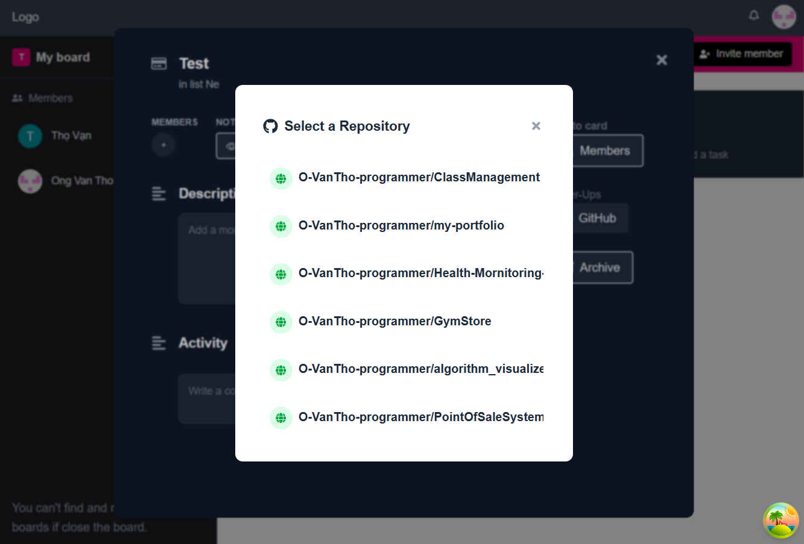

### Display All GitHub Information for a Repository
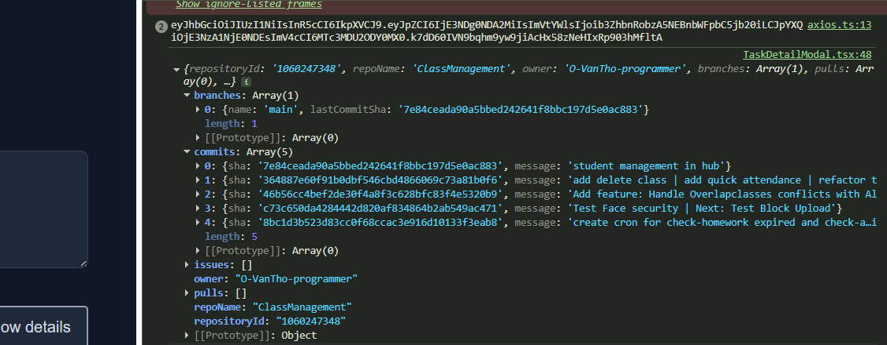
