<div align="center">

# 🏗️ Mini-Trello

### A High-Performance, Real-Time Kanban Board

**Engineered for Concurrency, Optimized for Scale**

[](https://nodejs.org/)
[](https://nextjs.org/)
[](https://redis.io/)
[](https://firebase.google.com/)
[](https://socket.io/)
[](https://www.typescriptlang.org/)

</div>

---

## Executive Summary

Mini-Trello is a **production-grade Kanban board** built to tackle the real-world engineering challenges that arise when hundreds of concurrent users collaborate on the same board in real-time. Unlike a typical CRUD application, this project is specifically designed to demonstrate solutions to three critical distributed systems problems: **heavy-write database bottlenecks**, **cross-instance real-time event synchronization**, and **perceived UI latency during network-dependent operations**.

The architecture leverages a **Write-Back caching layer** (Redis Streams), **distributed Pub/Sub event broadcasting** (Redis Adapter for Socket.io), and **Optimistic UI rendering** (React Query) to deliver a system that is horizontally scalable, fault-tolerant in its write path, and zero-latency from the user's perspective.

---

## System Architecture

```
┌──────────────────────────────────────────────────────────────────────────────────┐
│                              CLIENT (Next.js 14)                                 │
│                                                                                  │
│   ┌──────────────┐   ┌──────────────────┐     ┌─────────────────────────────┐    │
│   │  React Query │   │  Socket.io Client│     │  Optimistic UI Controller   │    │
│   │  (Cache+Sync)│   │  (WebSocket)     │     │  (Instant State Mutations)  │    │
│   └──────┬───────┘   └────────┬─────────┘     └──────────────┬──────────────┘    │
│          │                    │                              │                   │
└──────────┼────────────────────┼──────────────────────────────┼───────────────────┘
           │ HTTP/REST          │ WebSocket                    │
           ▼                    ▼                              │
┌──────────────────────────────────────────────────────────────┼───────────────────┐
│                        SERVER (Express.js + Socket.io)       │                   │
│                                                              │                   │
│   ┌────────────┐   ┌────────────────┐    ┌────────────────────▼─────────────┐    │
│   │ Controllers│   │  Socket.io     │    │  Redis Write-Back Service        │    │
│   │ (REST API) │──▶│  (Event Hub)   │    │  ┌─────────────────────────┐    │    │
│   └────────────┘   └───────┬────────┘    │  │ queueUpdate() → Stream  │     │    │
│                             │            │  │ Batch Processor (5s)    │     │    │
│                             │            │  │ Write Coalescing Engine │     │    │
│                             │            │  └─────────────────────────┘     │    │
│                             │            └─────────────────────┬─────────────┘    │
└─────────────────────────────┼──────────────────────────────────┼──────────────────┘
                              │                                  │
                              ▼                                  │
┌───────────────────────────────────────┐                        │
│          REDIS                        │                        │
│  ┌───────────────────────────────┐    │                        │
│  │  Pub/Sub Channels             │    │                        │
│  │  (Cross-Instance Broadcast)   │    │                        │
│  ├───────────────────────────────┤    │                        │
│  │  Redis Stream: write_aof      │    │                        │
│  │  (Durable Write Queue)        │◀───┼───────────────────────┘
│  │  Consumer Group: write_workers│    │
│  └───────────────────────────────┘    │
└───────────────────────────────────────┘
           │
           ▼ Batch Commit
┌──────────────────────┐
│  FIREBASE FIRESTORE  │
│  (Persistent Store)  │
└──────────────────────┘
```

---

## Real-World Problems & Engineering Solutions

### Problem 1: The "Heavy-Write" Bottleneck

#### The Problem

Consider 1,000 users simultaneously dragging tasks across columns on a Kanban board. Each drag-and-drop triggers not just one, but a cascade of write operations — every affected task's `order_number` must be updated, and cross-column moves require updating multiple documents atomically. A naïve implementation writes directly to the database on every event.

In a traditional architecture, this creates:
- **Write amplification**: A single drag may produce 10–50 individual `UPDATE` operations
- **I/O saturation**: Cloud databases like Firestore bill per write and throttle under burst loads
- **Cascading latency**: Each subsequent user must wait for the previous user's transaction to complete, creating a queue that degrades exponentially under load

At scale, this means a single busy board can generate **thousands of write operations per minute**, leading to lock contention, increased latency, and potential service-level throttling.

#### The Solution: Write-Back Caching with Redis Streams

Instead of writing directly to Firestore, the system implements a **Write-Back (Write-Behind) caching strategy** using Redis Streams as a durable append-only log:

**1. Fast-Queue to RAM (Redis Stream)**

When a task is moved, the model layer calls `redisWriteBackService.queueUpdate()`, which appends the update to a Redis Stream (`write_aof`) in **sub-millisecond** time. The HTTP response is returned immediately — the user is never blocked by database I/O.

```javascript
// server/models/Task.js — dragAndDropMove()
for (let i = 0; i < tasksInCard.length; i++) {
    await redisWriteBackService.queueUpdate(
        'tasks', tasksInCard[i].id, { order_number: i }
    );
}
```

**2. Write Coalescing Engine**

A background worker reads from the stream every 5 seconds. Before committing to Firestore, it applies **write coalescing** — if user A dragged a task 5 times in the same batch window, only the **final state** is written. This is achieved by merging updates keyed by `collection::documentId`:

```javascript
// Coalescing: 50 raw operations → 8 unique document updates
const key = `${collection}::${docId}`;
if (coalescedUpdates.has(key)) {
    coalescedUpdates.set(key, { ...coalescedUpdates.get(key), ...parsedData });
}
```

**3. Atomic Batch Commit**

The coalesced updates are committed to Firestore in a single `batch.commit()` call, ensuring atomicity and minimizing the number of billable write operations.

**4. Fallback Guarantee**

If Redis is unavailable, `queueUpdate()` falls back to a direct Firestore write, ensuring the system degrades gracefully rather than failing silently.

> **Result**: A burst of 500 drag operations across a batch window is coalesced into as few as 10–20 actual database writes, reducing Firestore costs and eliminating write contention.

---

### Problem 2: Distributed Real-Time Synchronization

#### The Problem

Socket.io, by default, stores all connection and room state **in the memory of a single Node.js process**. When User A drags a task and `socket.to(boardId).emit('task_move', data)` is called, only users connected to **that specific server instance** receive the update.

Behind a load balancer with N server instances, there is only a `1/N` chance that two collaborating users are connected to the same instance. At 4 instances, **75% of real-time events are silently lost**.

```
                    Load Balancer
                    ┌────┴────┐
              Server A      Server B
              ┌──────┐      ┌──────┐
              │User 1│      │User 2│   ← User 2 NEVER receives
              │User 3│      │User 4│     events from Server A
              └──────┘      └──────┘
```

#### The Solution: Redis Pub/Sub Adapter

The Socket.io Redis adapter (`@socket.io/redis-adapter`) uses Redis as a **centralized message bus**. Every socket event is published to a Redis Pub/Sub channel, and every server instance subscribes to that channel:

```javascript
// server/server.js
const pubClient = redisClient.duplicate();
const subClient = redisClient.duplicate();
io.adapter(createAdapter(pubClient, subClient));
```

With this adapter in place:
1. Server A receives a `task_move` event from User 1
2. Server A publishes the event to Redis Pub/Sub
3. Redis broadcasts the event to **all** subscribed server instances
4. Server B delivers the event to User 2 and User 4

```
              Server A ──publish──▶ Redis Pub/Sub ──broadcast──▶ Server B
              (User 1)                                           (User 2 ✓)
```

> **Result**: Real-time synchronization works identically whether the system runs on 1 instance or 100, enabling true horizontal scalability with zero application-level code changes.

---

### Problem 3: UI Network Latency (Perceived Performance)

#### The Problem

In a standard implementation, when a user drags a task:
1. The client sends an API request and **waits**
2. The server processes the request (50–300ms)
3. The server responds with the updated state
4. The client re-renders the UI

During steps 2–3, the task visually "snaps back" to its original position or freezes, creating a jarring user experience. In a geographically distributed setup with cross-region latency, this delay can exceed 500ms — making the app feel broken.

#### The Solution: Optimistic UI Updates with React Query

The frontend applies the state mutation **immediately** to the local cache before the network request is made. This is a three-phase strategy:

**Phase 1 — Instant Local Mutation (0ms)**

On `handleDragEnd`, the task array is reordered in-memory using `queryClient.setQueryData`, and the UI re-renders immediately with the new order:

```typescript
// Optimistic reorder — happens BEFORE any network call
const newTasks = [...tasksInCard];
newTasks.splice(prevIndex, 1);
newTasks.splice(newIndex, 0, movedTask);
queryClient.setQueryData(['tasks_by_card_id', cardId], newTasks);
```

**Phase 2 — Fire-and-Forget Sync**

Two parallel calls are dispatched simultaneously:
- `moveTask.mutate(...)` — HTTP request to persist the change via the Write-Back queue
- `socket.emit('task_move', ...)` — WebSocket event to notify other users

The user never waits for either to complete.

**Phase 3 — Automatic Rollback on Failure**

If the HTTP request fails, React Query's `onError` callback invalidates the optimistic cache, triggering a refetch from the server. The UI silently reverts to the true server state:

```typescript
onError: (error, { sourceCardId, destinationCardId }) => {
    queryClient.invalidateQueries({ queryKey: ["tasks_by_card_id", sourceCardId] });
    if (sourceCardId !== destinationCardId) {
        queryClient.invalidateQueries({ queryKey: ["tasks_by_card_id", destinationCardId] });
    }
}
```

> **Result**: The user perceives **zero latency** during drag-and-drop, regardless of network conditions. Failed operations are automatically corrected without user intervention.

---

## Drag & Drop Data Flow — Complete Lifecycle

The following diagram illustrates the full end-to-end data flow when a user drags a task:

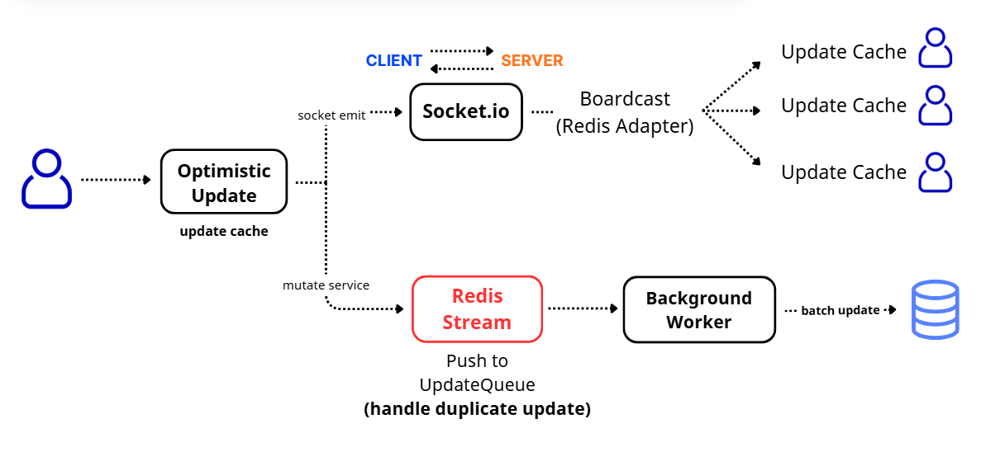

---

## User Authentication Flow — OAuth 2.0

The application supports **GitHub OAuth**, **Google OAuth**, and **Email Verification Code** authentication, all following the Authorization Code Flow pattern:

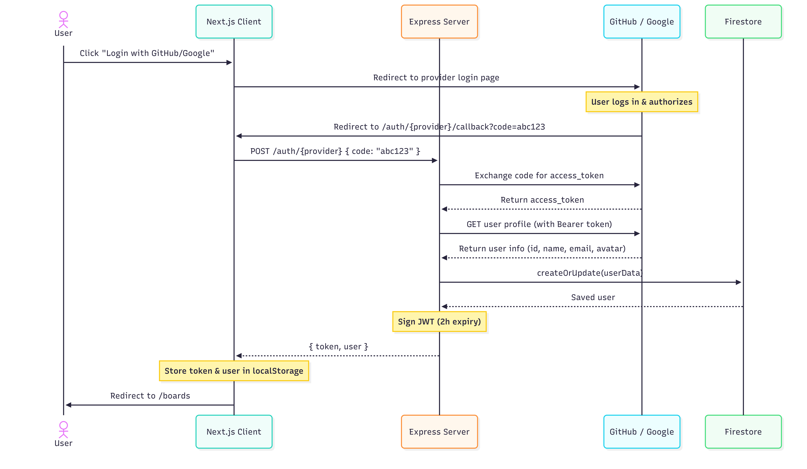

---

## Tech Stack

| Layer | Technology | Purpose |
|---|---|---|
| **Frontend** | Next.js 14 (App Router), TypeScript | SSR-capable React framework with strict typing |
| **State Management** | TanStack Query (React Query) | Server-state caching, optimistic updates, automatic refetching |
| **Real-Time (Client)** | Socket.io Client | Persistent WebSocket connection for live collaboration |
| **Drag & Drop** | @hello-pangea/dnd | Performant drag-and-drop with accessibility support |
| **Backend** | Express.js, Node.js | Lightweight HTTP server with middleware pipeline |
| **Real-Time (Server)** | Socket.io + Redis Adapter | WebSocket server with cross-instance event broadcasting |
| **Cache / Queue** | Redis (Streams + Pub/Sub) | Write-back queue (Streams), event relay (Pub/Sub) |
| **Database** | Firebase Firestore | Schemaless NoSQL with real-time listeners and batch operations |
| **Authentication** | OAuth 2.0 (GitHub, Google), JWT, Nodemailer | Multi-provider auth with stateless session tokens |
| **Styling** | Tailwind CSS | Utility-first CSS framework |

---

## Project Structure

```
MiniTrelloApp/
├── client/                        # Next.js 14 Frontend
│   ├── app/
│   │   ├── auth/                  # Login, Signup, OAuth Callback pages
│   │   ├── boards/[id]/           # Board page with drag-and-drop
│   │   └── components/            # Atomic & business UI components
│   ├── hooks/                     # React Query hooks (useTasks, useCards, etc.)
│   ├── services/                  # Axios-based API service layer
│   ├── lib/                       # Axios instance, Socket.io client
│   └── types/                     # Shared TypeScript interfaces
│
├── server/                        # Express.js Backend
│   ├── controllers/               # Request handlers (MVC)
│   ├── models/                    # Firestore data access layer
│   ├── routes/                    # REST API route definitions
│   ├── services/
│   │   └── redisWriteBackService.js  # Write-Back engine
│   ├── middleware/                 # JWT auth middleware
│   └── server.js                  # Entry point, Redis + Socket.io setup
```

---

## Getting Started

### Prerequisites

- **Node.js** v18+
- **Redis** server running locally on port `6379`
- **Firebase** project with Firestore enabled
- **OAuth credentials** for GitHub and/or Google

### 1. Clone the Repository

```bash
git clone https://github.com/O-VanTho-programmer/MiniTrelloApp.git
cd MiniTrelloApp
```

### 2. Backend Setup

```bash
cd server
npm install
```

Create a `.env` file in `server/`:

```env
PORT=5000
CLIENT_URL=http://localhost:3000
JWT_SECRET=your_super_secret_key

# OAuth
GITHUB_CLIENT_ID=your_github_client_id
GITHUB_CLIENT_SECRET=your_github_client_secret
GOOGLE_CLIENT_ID=your_google_client_id
GOOGLE_CLIENT_SECRET=your_google_client_secret

# Email (Nodemailer)
EMAIL_USER=your_email@gmail.com
EMAIL_PASS=your_email_app_password
```

Place your Firebase `serviceAccountKey.json` in the `server/` directory.

```bash
node server.js
```

Server runs at `http://localhost:5000`

### 3. Frontend Setup

```bash
cd ../client
npm install
```

Create a `.env.local` file in `client/`:

```env
NEXT_PUBLIC_SERVER_URL=http://localhost:5000
NEXT_PUBLIC_GITHUB_CLIENT_ID=your_github_client_id
NEXT_PUBLIC_GOOGLE_CLIENT_ID=your_google_client_id
```

```bash
npm run dev
```

Client runs at `http://localhost:3000`

---

## Application Screenshots

<details>
<summary>📸 Click to view screenshots</summary>

### Authentication
| Login | Sign Up | Verification Code |
|---|---|---|
| 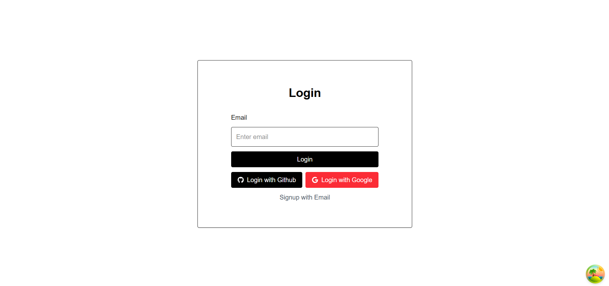 | 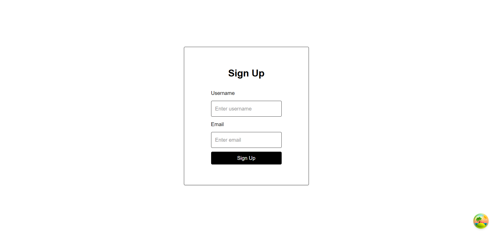 | 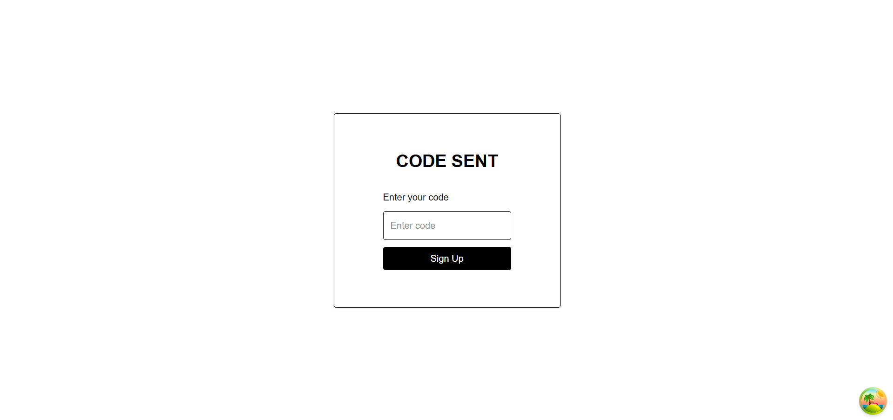 |

### Board Management
| Workplace | New Board | Board View |
|---|---|---|
| 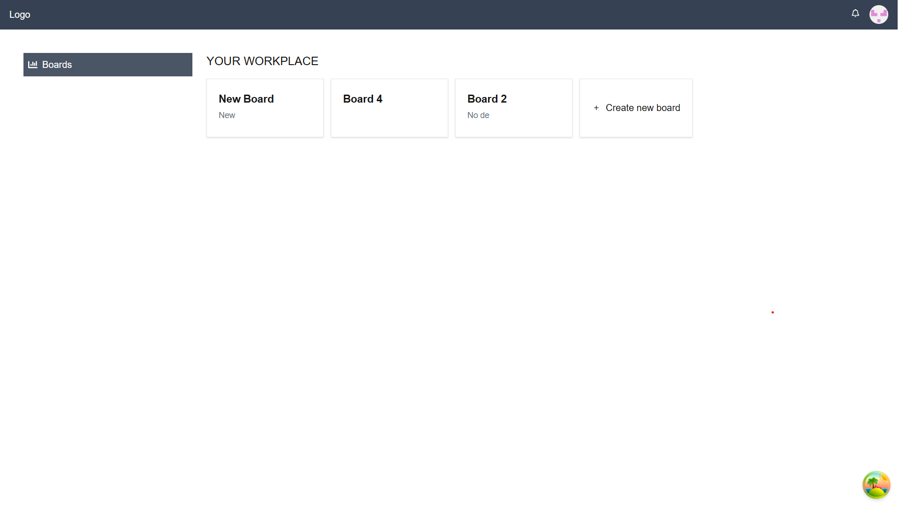 | 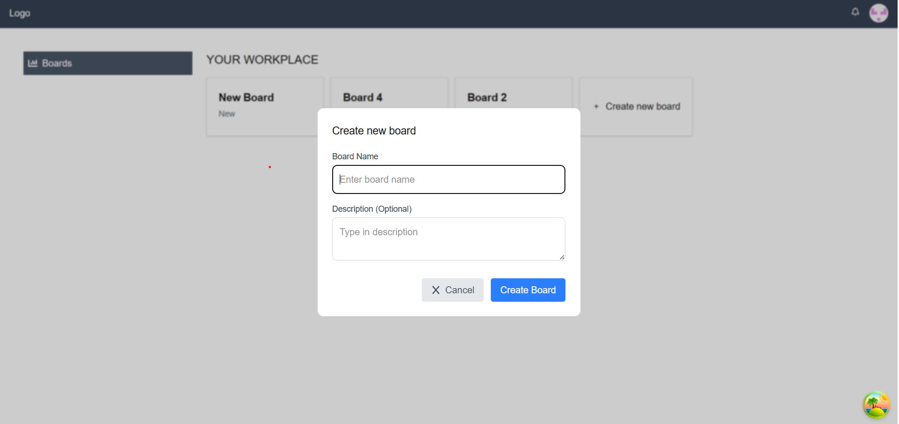 | 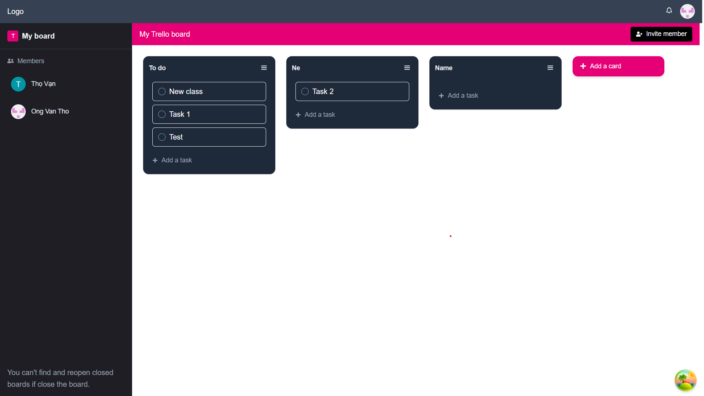 |

### Real-Time Collaboration
| Drag & Drop (User A) | Real-Time Update (User B) |
|---|---|
| 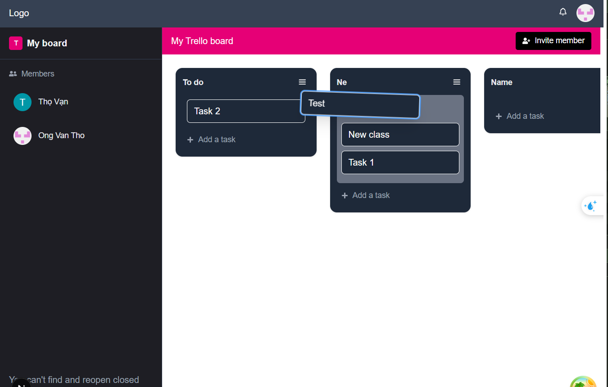 | 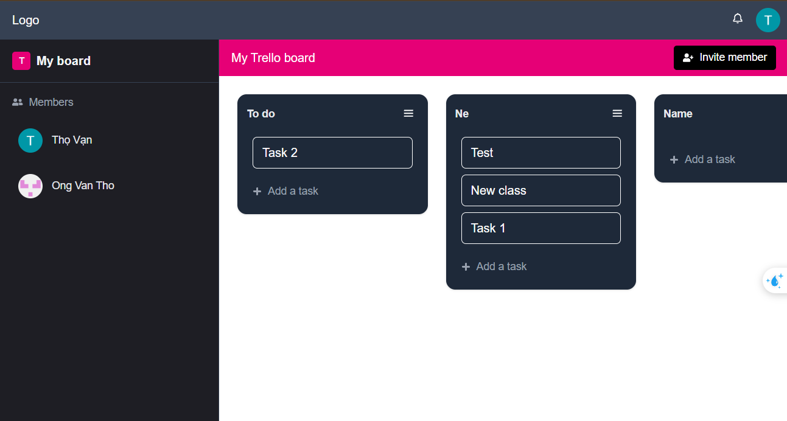 |

### Task & Member Management
| Task Detail & Assign Members | Invite to Board | Accept Invitation |
|---|---|---|
| 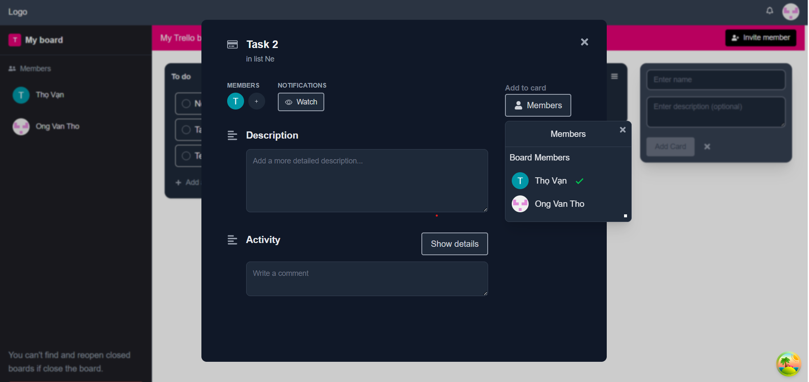 | 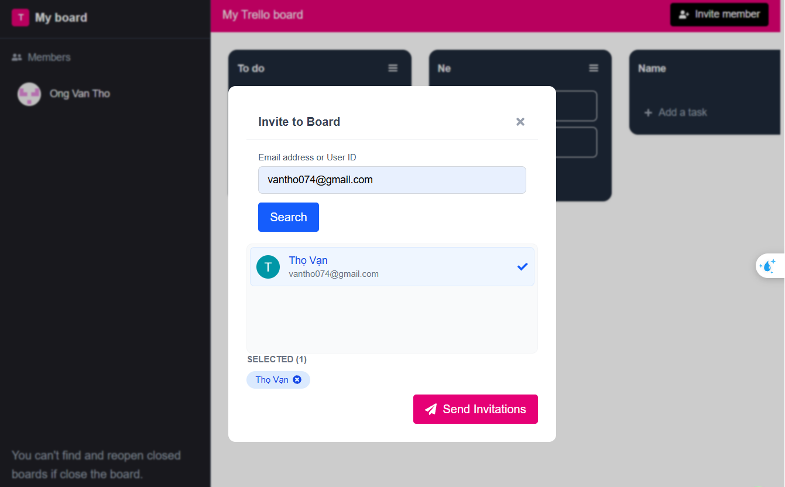 | 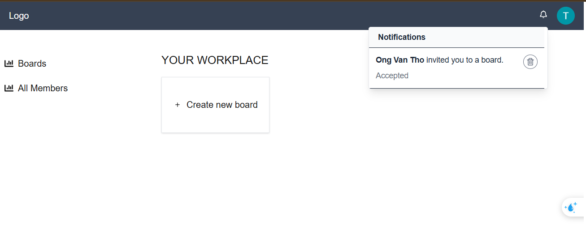 |

### GitHub Integration
| Repositories | Repository Detail |
|---|---|
| 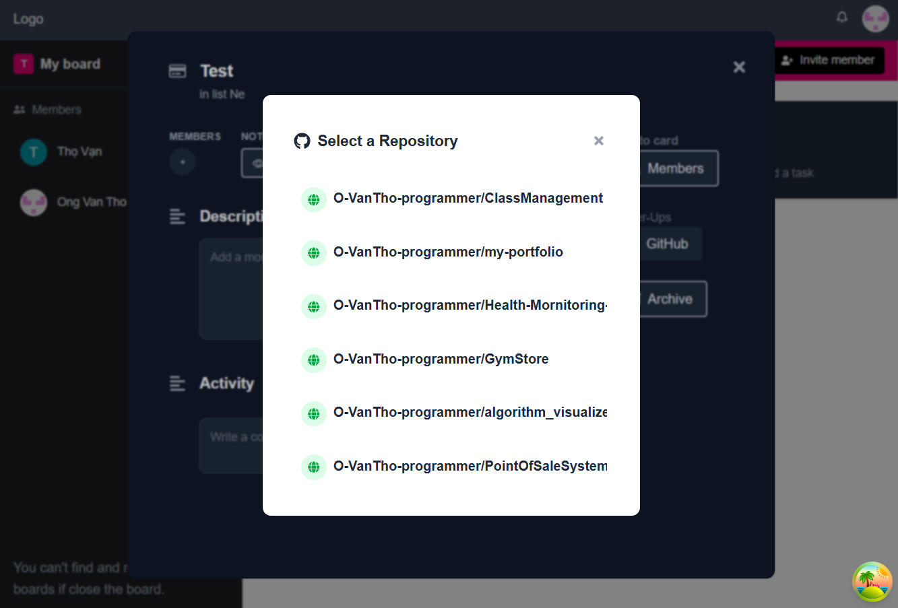 | 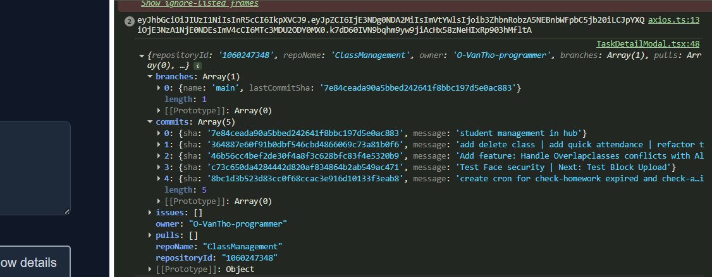 |

</details>

---

<div align="center">

**Built with a focus on Engineering Excellence**

*Mini-Trello is a learning and portfolio project demonstrating advanced backend architecture patterns used in production-grade collaborative applications.*

</div>
